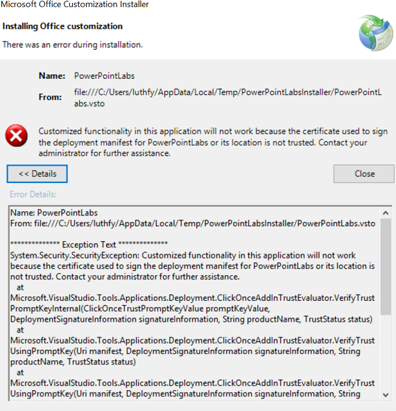
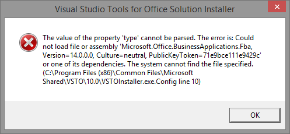
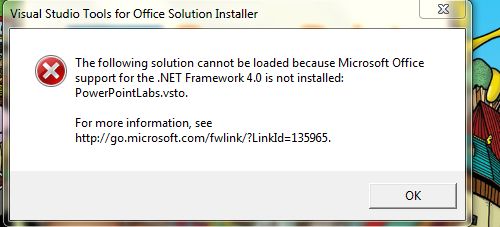
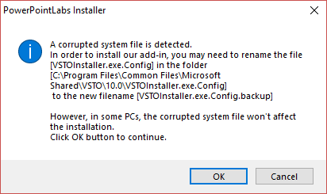
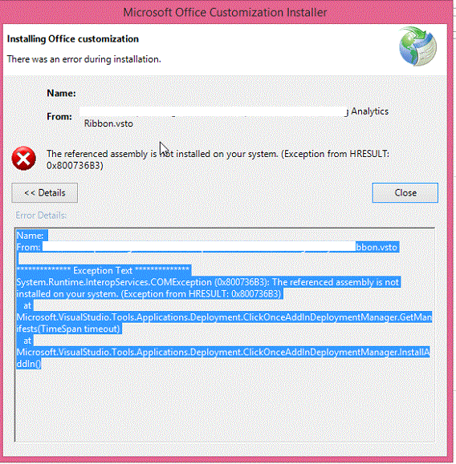
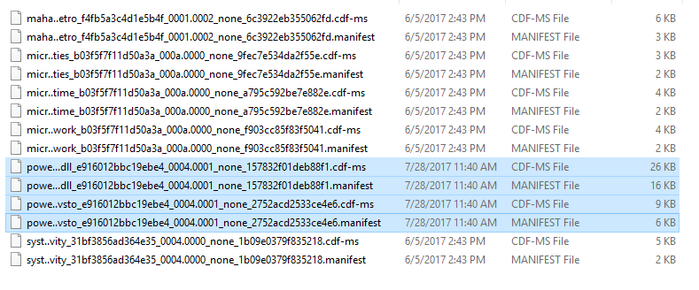

 # Technical Troubleshooting Guide

This guide serves as a collection of technical issues/solutions commonly seen when trying to install PowerPointLabs.

If better solutions to any issue are found, or if there is a need for any clarification, please kindly let us know at pptlabs@comp.nus.edu.sg

### Table of Issues
1. [Certificate Not Trusted](#cert-not-trusted)
1. [VSTO Installer Config Error](#vsto-installer-config)
1. [NET Framework Not Installed](#net-not-installed)
1. [VSTO Opens as XML Error](#vsto-as-xml)
1. [Missing PowerPointLabs Ribbon](#missing-ribbon)
1. [Corruption requiring renaming of VSTOInstaller.exe.config File](#rename-vsto-file)
1. [Installation Failure caused by ClickOnce Cache](#clickonce-cache)
1. [Referenced Assembly Not Installed](#assembly-not-installed)
1. [Corrupted Zip Installer](#corrupted-zip)
1. [Installation Error due to Preexisting Similar Application](#preexisting-application)
1. [Error Loading Manifest from MahApps.Metro.dll](#error-manifest)

## Certificate Not Trusted<a name="cert-not-trusted"></a>
#### Error Message

#### Solution
1. Try to download and install from the [standalone version](https://www.google.com/url?q=http%3A%2F%2Fwww.comp.nus.edu.sg%2F~pptlabs%2Fdownload-78563%2FPowerPointLabsInstaller.zip)
1. If standalone is not working, click OK for the batch file and install again
1. Else, verify admin permission and install again

## VSTO Installer Config Error<a name="vsto-installer-config"></a>
#### Error Message

#### Solution
1. Click the Windows Start button and paste `<VSTO Folder Path>` into the search box. Note that `<VSTO Folder Path>` would be stated in the error message
1. Enter and it should open up the VSTO folder
1. Find a file named `VSTOInstaller.exe.config`
1. Rename the file to `VSTOInstaller.exe.config.old`. Ignore Windows warning about the file becoming unusable
1. Run PowerPointLabs installer again
1. After installation has completed, reopen the VSTO folder and rename the file back to `VSTOInstaller.exe.config` again

## NET Framework Not Installed<a name="net-not-installed"></a>
#### Error Message

#### Solution
1. Follow these [instructions](https://msdn.microsoft.com/en-sg/library/ms178739.aspx) to install Visual Studio Tools for Office runtime
1. Install PowerPointLabs again

## VSTO Opens as XML Error<a name="vsto-as-xml"></a>
#### Error
Add-in failed to install, and browswer opens up with the following image

#### Solution
1. Follow these [instructions](https://msdn.microsoft.com/en-sg/library/ms178739.aspx) to install Visual Studio Tools for Office runtime
1. Install PowerPointLabs again

## Missing PowerPointLabs Ribbon<a name="missing-ribbon"></a>
#### Error
After installation, PowerPointLabs ribbon do not show even after launching PowerPoint
#### Solution
1. Restart PowerPoint, else restart Windows and try again
1. Try the following steps to re-activate add-in:
   1. In PowerPoint application, click `File` tab at the top left corner
   1. Click `Options` button
   1. Click `Trust Center` -> `Trust Center Settings` -> `Add-ins`
   1. Uncheck all boxes and click `OK`
   1. Under PowerPoint options, click `Add-ins`
   1. Beside `Manage`, click `Go`
   1. Check `PowerPointLabs` to enable it and click `OK`
   1. Restart PowerPoint

## Corruption requiring renaming of VSTOInstaller.exe.config File<a name="rename-vsto-file"></a>
#### Error Message

#### Solution
1. Rename the file to any appropriate name
1. Ensure that you have admin permissions and follow these [instructions](https://msdn.microsoft.com/en-sg/library/ms178739.aspx) to re-install Visual Studio Tools for Office runtime
1. Ensure that you right-click on the `vstor_redist.exe` (VSTO Installer) installation file and choose `Run as Administrator` before starting the installation

## Installation Failure caused by ClickOnce Cache<a name="clickonce-cache"></a>
#### Error Message

#### Solution
1. Follow these [instructions](https://msdn.microsoft.com/en-sg/library/ms178739.aspx) to install Visual Studio Tools for Office runtime
1. Open `Start`
1. Type `cmd` and press `Enter`
1. Paste the following command and press `Enter`: `rundll32 %windir%\system32\dfshim.dll CleanOnlineAppCache`
1. Reinstall PowerPointLabs again

## Referenced Assembly Not Installed<a name="assembly-not-installed"></a>
#### Error Message

```
System.Runtime.InteropServices.COMException (0x800736B3): The referenced assembly is not installed on your system. (Exception from HRESULT: 0x800736B3)
 at Microsoft.VisualStudio.Tools.Applications.Deployment.ClickOnceAddInDeploymentManager.DownloadAddIn(TimeSpan timeout)
 at Microsoft.VisualStudio.Tools.Applications.Deployment.ClickOnceAddInDeploymentManager.InstallAddIn()
```
#### Solution
1. Open `Start`
1. Type `cmd` and press `Enter`
1. Paste the following command and press `Enter`: `rundll32 %windir%\system32\dfshim.dll CleanOnlineAppCache`
1. Reinstall PowerPointLabs
1. Else, delete folder `%LocalAppData%\Apps\2.0` and reinstall PowerPointLabs again

## Corrupted Zip Installer<a name="corrupted-zip"></a>
#### Error
Unable to unzip the installer and/or error message associated with operation of unzipping the installer
#### Solution
1. Re-download the installer files and try installing again
1. If multiple re-downloads fail, download the setup.exe directly [here](https://www.google.com/url?q=http%3A%2F%2Fwww.comp.nus.edu.sg%2F~pptlabs%2Fdownload-78563%2FPowerPointLabsInstaller.zip) and re-install

## Installation Error due to Preexisting Similar Application<a name="preexisting-application"></a>
#### Error Message

#### Solution
1. Go to `File Explorer`
1. Type in `%LocalAppData%\Apps\2.0` in the navigation bar and press `Enter`
1. Using the search bar on the top-right corner, locate the `Manifests` folder
1. Delete all files starting with `powe...` as shown in the below image


## Error Loading Manifest from MahApps.Metro.dll<a name="error-manifest"></a>
#### Error Message

#### Solution
1. Open `Start`
1. Type `cmd` and press `Enter`
1. Type in `cd C:\Users\pvolowz\AppData\Local\Temp\Deployment\1HKX7LKW.XZD\HYEJO9YP.GNM`
1. Type in `tasklist.exe /m MahApps.Metro.dll`
1. Determine which process is using the dll and end it if possible
1. Else, delete folder `C:\Users\pvolowz\AppData\Local\Temp\Deployment` and reinstall PowerPointLabs again
